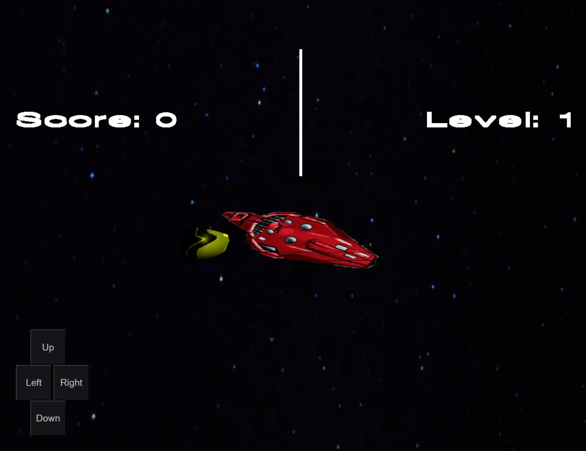
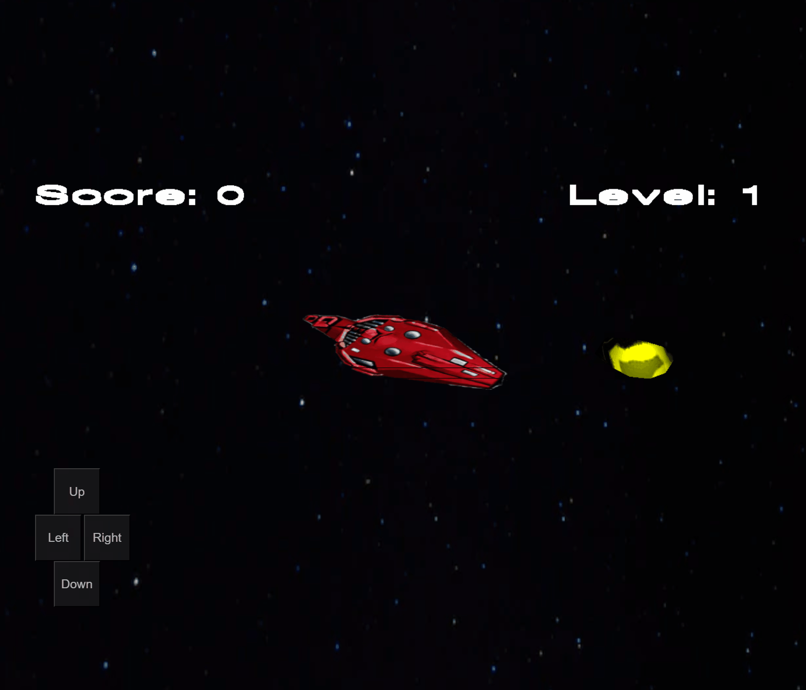

Cosmic Blast
==============

A 3D web-based space game, developed with ChatGPT4.

Your spaceship is under attack by a meteor storm. You must destroy all incoming meteors in order to survive. Can you destroy them all?

[Play Online](https://cosmic-blast.primaryobjects.repl.co/)

*Created by ChatGPT4 in about 3 hours, off-and-on conversation. Images created by StableDiffusion.*

## About

Inspired by the Atari 2600 game [Cosmic Arc](https://en.wikipedia.org/wiki/Cosmic_Ark).

## Screenshots

### Cover image

### Game play

## License

MIT

## Author

Kory Becker http://www.primaryobjects.com/kory-becker